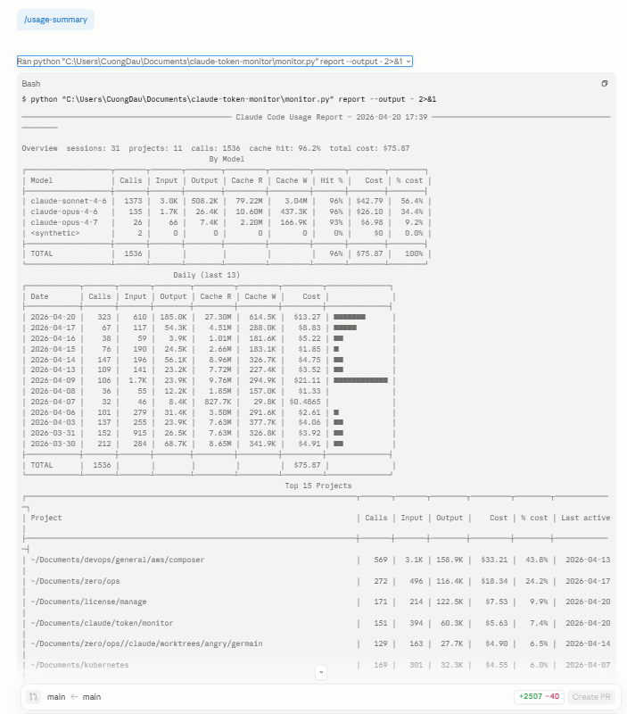

# token-monitor — Claude Code Plugin

Track Claude Code token spend, cache efficiency, and daily trends inside Claude Code.

No API calls. No daemon. Parses the JSONL logs Claude Code already writes to `~/.claude/projects/`.

---

## Install

```bash
pip install rich>=13.0.0
```

Requires Python 3.10+.

---

## Usage

```
/usage-summary [subcommand or project]
```



| Invocation | Runs |
|---|---|
| `/usage-summary` | Full dashboard (models, daily, projects, heatmap, suggestions) |
| `/usage-summary composer` | Project-filtered report |
| `/usage-summary daily 7` | `daily --days 7` |
| `/usage-summary weekly` | `weekly --weeks 8` |
| `/usage-summary projects 10` | `projects --top 10` |
| `/usage-summary sessions` | `sessions --top 15` |
| `/usage-summary heatmap calls` | `heatmap --metric calls` |
| `/usage-summary calendar 2026` | `calendar --year 2026` |
| `/usage-summary cache` | `cache --top 15` |
| `/usage-summary budget` | `budget` |
| `/usage-summary suggest` | `suggest` |
| `/usage-summary trend zero/ops` | `trend zero/ops` |
| `/usage-summary activity 14` | `activity --days 14` |
| `/usage-summary export json` | `export --format json` |

Any unrecognized argument is treated as a project name filter.

---

## Efficiency Suggestions

The full dashboard and `suggest` subcommand flag cost patterns:

| Rule | What it catches |
|---|---|
| `opus-heavy-project` | Projects where Opus handles routine edits — switch to Sonnet |
| `opus-routine-session` | Short-output Opus sessions not using reasoning |
| `day-spike` | Days costing 3× median — likely runaway context |
| `low-cache-hit` | Poor cache reuse per project or session |
| `raw-input-spike` | Massive raw input turns (noisy tool output in context) |
| `session-fragmentation` | Many short sessions causing cache rebuild overhead |
| `cache-rebuild` | High cache-write vs cache-read ratio |
| `many-reads` | Read/Grep-heavy sessions — ast-graph could replace |
| `explore-on-opus` | Exploration/plan sessions on Opus unnecessarily |

Savings estimates are directional (Opus→Sonnet ≈ 80% cheaper).

---

## Budget hook

```json
{
  "hooks": {
    "SessionEnd": [
      { "command": "python ${CLAUDE_PLUGIN_ROOT}/monitor.py budget --daily 30 --monthly 500" }
    ]
  }
}
```

`--strict` exit codes: `0` under warn · `2` approaching limit · `1` over limit.
